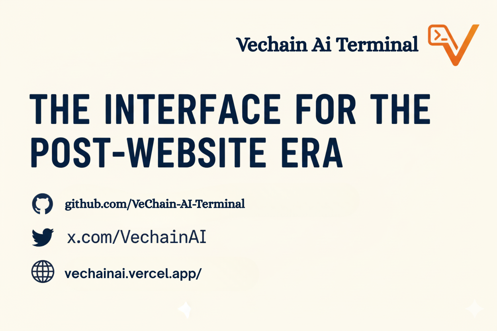
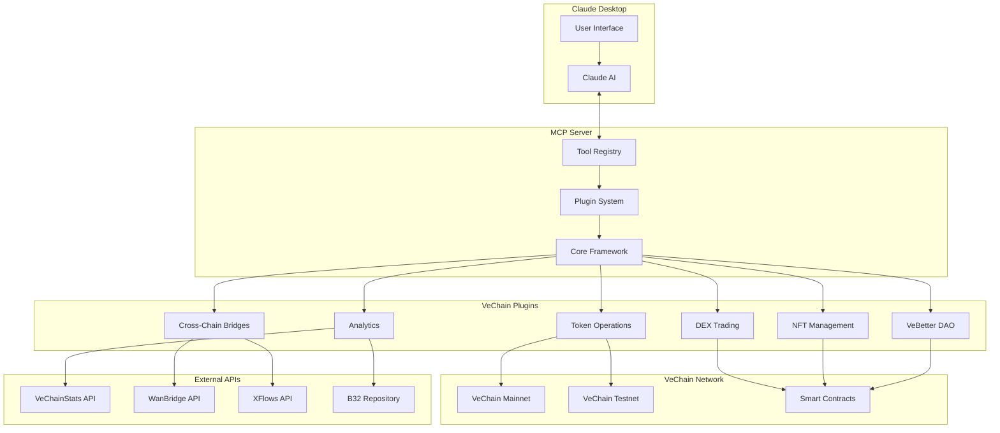
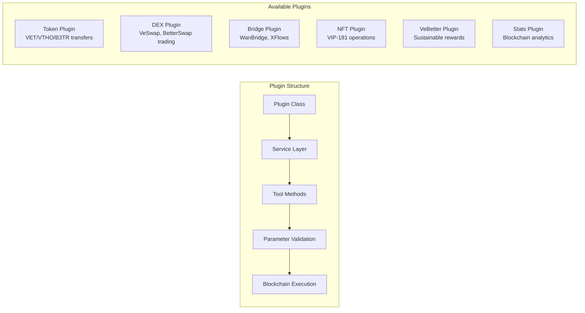

# VeChain AI Terminal
## MCP Server



A Model Context Protocol (MCP) server that enables Claude Desktop to interact with the VeChain blockchain through natural language commands. The server provides comprehensive blockchain operations including token transfers, DEX trading, cross-chain bridges, NFT management, and VeBetter DAO interactions.

## Overview

VeChain AI Terminal bridges the gap between AI assistants and blockchain functionality by providing a natural language interface to VeChain's ecosystem. Users can perform complex blockchain operations through simple conversational commands with Claude Desktop.

## Architecture



## System Components

### Core Framework
- **Tool Decorator System**: Marks functions as AI-accessible tools with parameter validation
- **Plugin Base**: Abstract foundation for all blockchain operation plugins
- **Wallet Client**: Manages VeChain wallet connections and transaction signing
- **Registry Services**: Maintains contract addresses, token definitions, and ABI mappings

### Plugin Architecture


## Features

### Blockchain Operations
- **Token Transfers**: Native VET and VIP-180 token operations
- **Balance Queries**: Real-time account balance monitoring
- **Transaction History**: Comprehensive transaction tracking
- **Gas Estimation**: Automatic fee calculation and optimization

### DEX Integration
- **Multi-DEX Support**: VeSwap, BetterSwap, Vexchange integration
- **Price Discovery**: Real-time token price feeds and comparison
- **Liquidity Analysis**: Pool information and trading volume metrics
- **Swap Execution**: Automated token exchange with slippage protection

### Cross-Chain Operations
- **WanBridge Integration**: Secure asset transfers between networks
- **XFlows Support**: Advanced cross-chain swap protocols
- **Bridge Monitoring**: Real-time transfer status tracking
- **Multi-Network Support**: Ethereum, Polygon, BSC connectivity

### NFT Management
- **VIP-181 Operations**: Complete NFT lifecycle management
- **Metadata Handling**: IPFS integration for rich media content
- **Collection Analytics**: Comprehensive NFT project statistics
- **Transfer Operations**: Secure ownership transfers

### VeBetter DAO
- **Sustainable Actions**: Submit and validate eco-friendly activities
- **B3TR Rewards**: Automated token distribution for verified actions
- **Governance Participation**: Proposal voting and delegation
- **Impact Tracking**: Environmental contribution monitoring

## Quick Start

### Prerequisites

- Claude Desktop application
- Node.js 18 or higher
- pnpm package manager
- VeChain wallet (private key or mnemonic)

### Installation

1. **Clone and build the server**
   ```bash
   git clone https://github.com/VeChain-AI-Terminal/vechain-mcp-server
   cd vechain-mcp-server
   pnpm install
   pnpm build
   ```

2. **Configure environment variables**
   ```bash
   cp .env.example .env
   ```
   Edit `.env` file with your wallet credentials and network preferences.

3. **Automated Setup (Recommended)**
   
   Use the automated setup script to configure your preferred AI application:
   
   ```bash
   # Interactive mode - choose which application to configure
   pnpm setup
   
   # Configure Claude Desktop only
   pnpm setup:claude
   
   # Configure Cursor editor only
   pnpm setup:cursor
   
   # Configure VS Code only
   pnpm setup:code
   
   # Configure multiple applications
   ./setup-mcp.sh --claude --cursor --code
   ```
   
   The setup script will:
   - Read your `.env` configuration
   - Generate the appropriate MCP configuration
   - Install it in the correct location for your chosen application(s)
   - Provide restart instructions

4. **Manual Configuration (Alternative)**
   
   If you prefer manual setup, you can configure the applications directly:
   
   **Claude Desktop**: `~/Library/Application Support/Claude/claude_desktop_config.json`
   **Cursor Editor**: `~/.cursor/mcp.json` (global) or `.cursor/mcp.json` (project-specific)  
   **VS Code**: `~/Library/Application Support/Code/User/mcp.json` (global) or `.vscode/mcp.json` (project-specific)
   
   The configuration format should look like:
   ```json
   {
     "mcpServers": {
       "vechain-mcp": {
         "command": "node",
         "args": ["/absolute/path/to/vechain-mcp-server/dist/index.js"],
         "env": {
           "WALLET_MNEMONIC": "your twelve word mnemonic phrase here",
           "VECHAIN_NETWORK": "testnet",
           "VECHAINSTATS_API_KEY": "your_vechainstats_api_key",
           "VEBETTER_REWARDS_POOL_ADDRESS": "0x5F8f86B8D0Fa93cdaE20936d150175dF0205fB38",
           "VEBETTER_B3TR_TOKEN_ADDRESS": "0xbf64cf86894Ee0877C4e7d03936e35Ee8D8b864F",
           "VEBETTER_APPS_REGISTRY_ADDRESS": "0xcB23Eb1bBD5c07553795b9538b1061D0f4ABA153",
           "VEBETTER_APP_ID": "your_app_id_here",
           "BRIDGE_API_URL": "https://bridge-api.wanchain.org/api",
           "BRIDGE_PARTNER": "vechain-ai-superapp"
         }
       }
     }
   }
   ```

5. **Restart your AI application**

Close and reopen Claude Desktop, Cursor, or VS Code to load the MCP server.

### Environment Configuration

| Variable | Required | Description |
|----------|----------|-------------|
| `WALLET_PRIVATE_KEY` | Either | VeChain wallet private key |
| `WALLET_MNEMONIC` | Either | VeChain wallet mnemonic phrase |
| `VECHAIN_NETWORK` | Yes | Network selection: `mainnet` or `testnet` |
| `VECHAINSTATS_API_KEY` | No | Enhanced blockchain data access |
| `VEBETTER_ACTION_CONTRACT` | No | VeBetter action submission contract |
| `VEBETTER_REWARD_CONTRACT` | No | VeBetter reward distribution contract |

### Network Endpoints

- **Testnet**: `https://testnet.veblocks.net` (development use)
- **Mainnet**: `https://mainnet.veblocks.net` (production use)

## Usage Examples

### Token Operations
```
"Transfer 100 VET to 0x742d35Cc6651Fb66D8dD9b2a5D35bfa2F9d2E7c7"
"Check my VTHO balance"
"Send 50 B3TR tokens to alice.vet"
```

### DEX Trading
```
"Swap 100 VET for VTHO on VeSwap"
"Get the best price for 1000 B3TR to VET"
"What's the current VET/VTHO exchange rate?"
```

### Cross-Chain Operations
```
"Bridge 500 VET from VeChain to Ethereum using WanBridge"
"Check my bridge transaction status for hash 0x..."
"What are the current bridge fees for VET to Polygon?"
```

### NFT Operations
```
"Mint an NFT with metadata from ipfs://QmHash"
"Transfer my NFT #123 from collection 0x... to 0x..."
"Show me all NFTs in my wallet"
```

### VeBetter Rewards
```
"Submit a sustainable action: I used public transport for 20km today"
"Check my available B3TR rewards"
"Claim my pending VeBetter rewards"
```

### Analytics and Data
```
"Show me the latest VeChain network statistics"
"What's the current VET price and market cap?"
"Get transaction history for the last 7 days"
```

## Development

### Plugin Development

Create new plugins by extending the base plugin class:

```typescript
import { PluginBase } from '../core/PluginBase';
import { Tool } from '../core/Tool.decorator';

export class CustomPlugin extends PluginBase {
  @Tool({
    description: "Custom blockchain operation",
    parameters: {
      address: { type: "string", description: "Target address" }
    }
  })
  async customOperation(address: string) {
    // Implementation
  }
}
```

### Adding New Tools

1. Create plugin file in `src/plugins/`
2. Implement service methods with `@Tool` decorators
3. Register plugin in `src/index.ts`
4. Build and test functionality

### Testing

```bash
# Development mode
pnpm dev

# Type checking
pnpm typecheck

# Production build
pnpm build

# Test MCP connection
pnpm test-mcp
```

## Security Considerations

### Wallet Security
- Store private keys securely using environment variables
- Never commit credentials to version control
- Use testnet for development and testing
- Verify all transaction details before execution

### API Security
- Protect API keys with appropriate access controls
- Use HTTPS for all external API communications
- Implement rate limiting for high-frequency operations
- Validate all input parameters and responses

### Network Security
- Use official RPC endpoints for blockchain connections
- Verify smart contract addresses before interaction
- Monitor transaction fees and gas usage
- Implement proper error handling and logging

## Integration APIs

### VeChain SDK
Core blockchain operations using official VeChain TypeScript SDK with support for transaction creation, signing, and broadcasting.

### VeChainStats API
Comprehensive blockchain analytics including network statistics, token information, and transaction history.

### WanBridge API
Cross-chain bridge operations for secure asset transfers between VeChain and other blockchain networks.

### XFlows API
Advanced cross-chain swap protocols enabling complex multi-hop transactions across different networks.

### B32 Repository
Dynamic ABI loading system for smart contract interactions without requiring manual ABI management.

## Troubleshooting

### Common Issues

**Tool not found errors**
- Restart Claude Desktop after configuration changes
- Verify absolute paths in configuration file
- Check environment variable settings

**Invalid address formats**
- Ensure VeChain addresses start with 0x
- Verify address checksums for accuracy
- Use proper ENS name resolution where supported

**Insufficient balance errors**
- Check VET balance for transaction fees
- Verify token balances before transfers
- Consider network congestion effects on gas prices

**Network connectivity issues**
- Verify RPC endpoint accessibility
- Check firewall and proxy settings
- Test alternative network endpoints

### Debug Mode

Enable detailed logging:
```bash
export DEBUG=true
pnpm dev
```

## Contributing

This project demonstrates AI-blockchain integration patterns and welcomes contributions. Please follow these guidelines:

1. Fork the repository and create feature branches
2. Follow TypeScript coding standards and conventions
3. Add comprehensive tests for new functionality
4. Update documentation for API changes
5. Submit pull requests with detailed descriptions

## License

MIT License - see LICENSE file for complete terms and conditions.

---

**VeChain AI Terminal** - Bridging artificial intelligence with blockchain technology through natural language interactions.